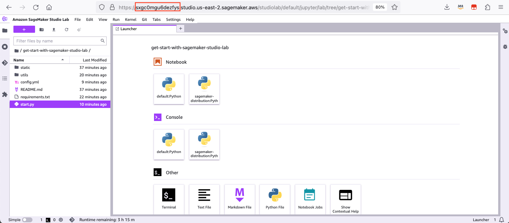

# Get Started with SageMaker Studio Lab

Amazon SageMaker Studio Lab 是一個免費的機器學習開發環境，免費提供運算、儲存（高達15GB）和安全，供任何人使用機器學習進行學習和實驗。 您只需一個有效的電子郵件地址即可開始使用，無需設定基礎設施或管理身分和存取權限，甚至**無需註冊 AWS 帳戶**。官網詳情請見[這裡](https://aws.amazon.com/tw/sagemaker/studio-lab/)。

## 選擇環境

方法一：若要能在您本地環境進行設定，可以用本地的 Terminal。

方法二：若想要透過雲端環境執行 app，您可以透過 SageMaker Studio Lab 的免費資源執行 app，步驟如下 :

請您先用 email 註冊一個免費的 SageMaker Studio Lab 帳號，您只需要提供您的 email 資訊即可，不需要 AWS 帳戶即可以開始使用，開始註冊請點選[這裡](https://studiolab.sagemaker.aws/)。

登入後，請點選 Start runtime，然後點選 Open project。


進入 SageMaker Studio Lab 的主畫面，請開啟 Terminal，在 Terminal 進行設定。


## 設定 AWS CLI

請您先進行 AWS CLI 的設定，細節請參閱[這裡](https://docs.aws.amazon.com/zh_tw/cli/latest/userguide/getting-started-quickstart.html) : 
* 使用命名設定檔，或者
* 使用環境變數來設定 AWS CLI

若要使用命名設定檔，請先設定 AWS Access Key ID 和 AWS Secret Access Key。

```{shell}
aws configure
```

## 開始使用

### 用 Gradio 快速建立一個生成式 AI 應用

安裝對應版本的 AWS Python SDK，和所需要的 Python 開源函式庫。

```{shell}
pip3 install -r requirements.txt
```

步驟 1 : 設定參數，在 `config.yml` 檔案中設定您的環境變數。

步驟 2 : 執行 Gradio app。

```{shell}
python start.py
```

步驟 3 : 在瀏覽器輸入以下網址。請將其中的 `<unique identifier>` 替換成您 SageMaker Studio Lab 網址內的字串：



```{shell}
https://<unique identifier>.studio.us-east-2.sagemaker.aws/studiolab/default/jupyter/proxy/8080/
```

步驟 4（可略）: 您可能需要更改埠口（port），預設值是 8080。


設定完成，可以開始使用 Gradio app 測試 Amazon Bedrock！


